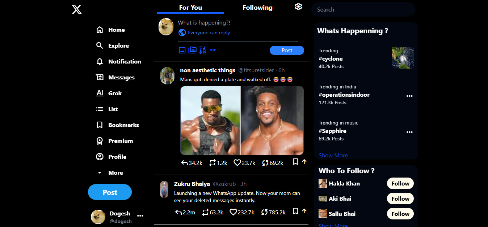
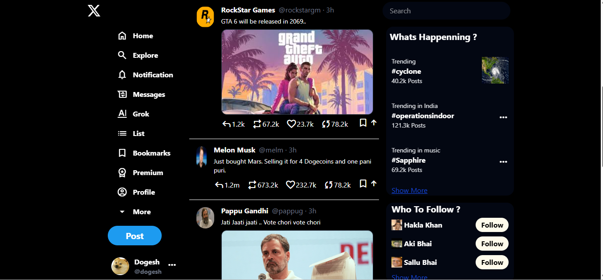
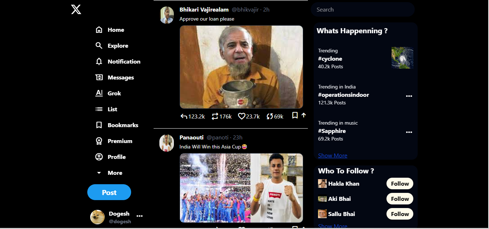

# 🐦 Twitter Clone

A responsive **Twitter UI clone** built with **HTML, Tailwind CSS, and JavaScript**.  
This project is for practicing front-end development, responsive design, and interactive UI building.

---

## ✨ Features

- 📱 **Mobile-friendly layout** (Tailwind CSS)  
- 📰 **Scrollable feed** like real Twitter  
- 👤 Profile & post section mockup  
- 💬 Interactive buttons (reply, retweet, like placeholders)  
- 🎨 Clean and modern UI  

---

## 🛠️ Tech Stack

- **HTML5** – Structure  
- **Tailwind CSS** – Styling & responsiveness  
- **JavaScript (Vanilla)** – Interactivity  

## 📸 Screenshots

  
  
  

---

## 👤 Author

- [Parth Kamath](https://github.com/ParthK604)
